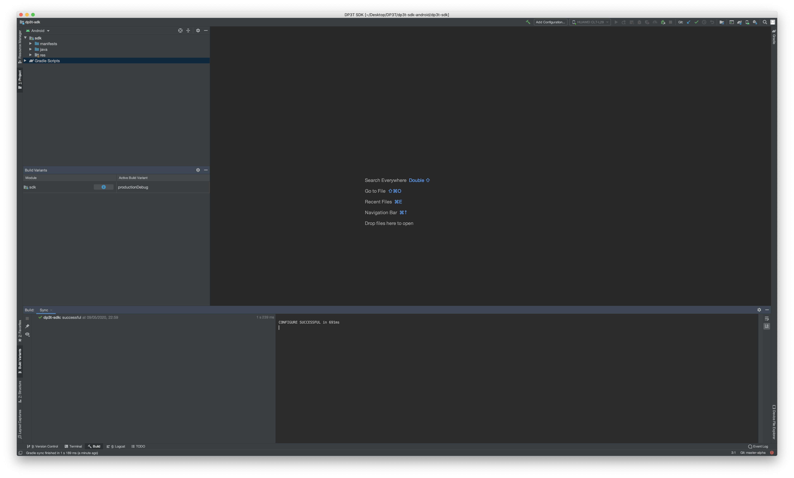
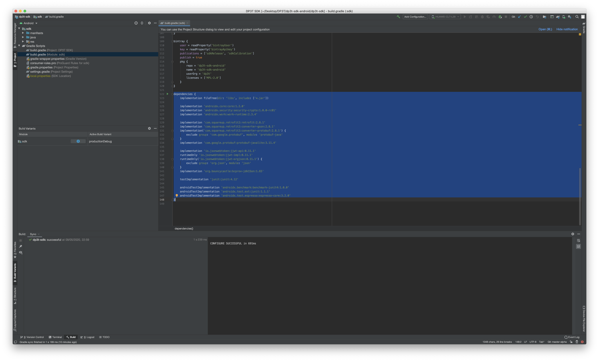
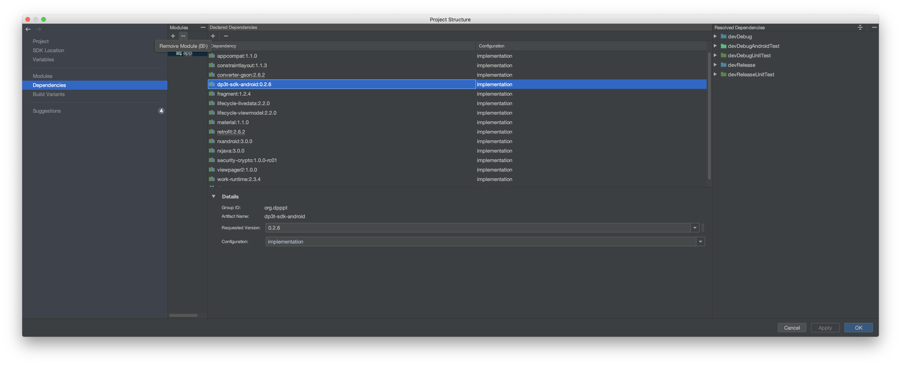
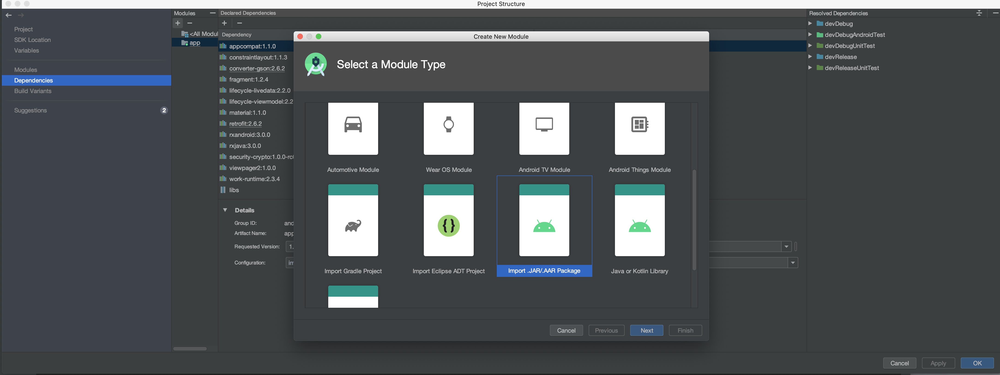
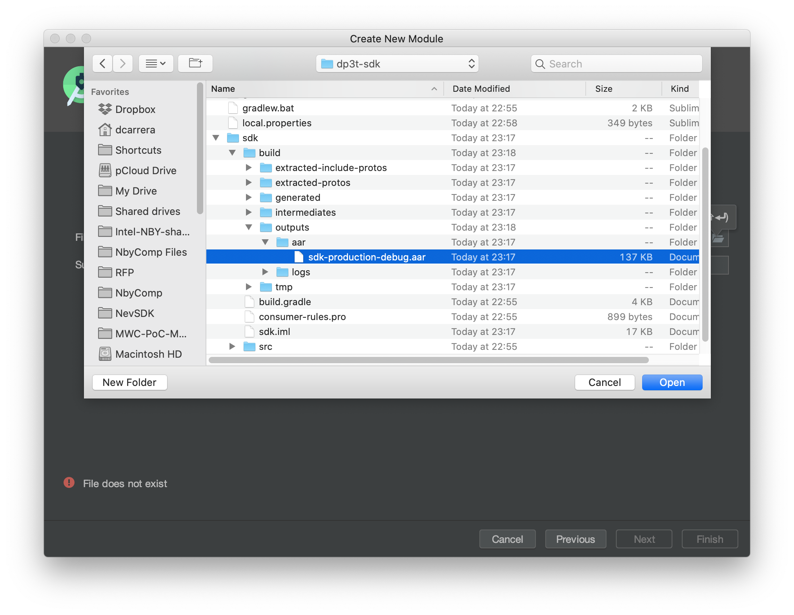
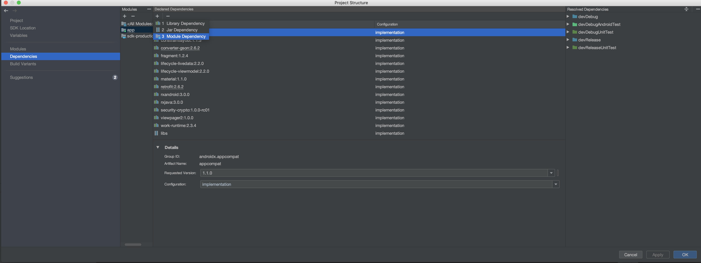
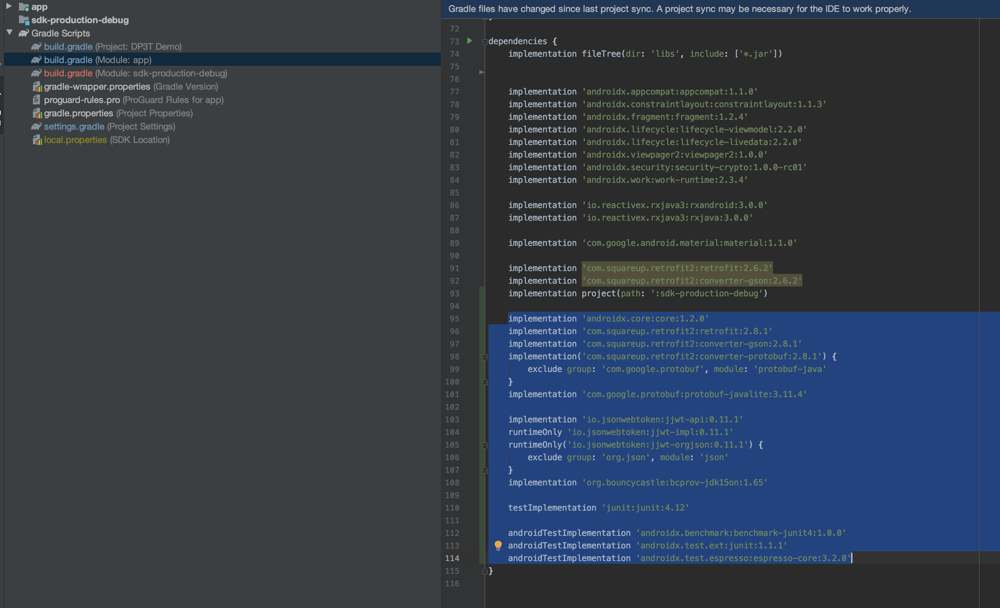

[Back to Index](../README.md)

# Developer notes:  APP & SDK (Android)

## Android Studio preparation

- Clone the two repositories:
```
SDK: https://github.com/DP-3T/dp3t-sdk-android.git
APP: https://github.com/DP-3T/dp3t-app-android.git
```


- Open SDK in Android Studio and import "gradle" project into the framework

- Set the Build Variant to "productionDebug" for the SDK and make project (F9)
[](images/set-build-variant-sdk.png)


- Find the output aar in 

```
dp3t-sdk-android/dp3t-sdk/sdk/build/outputs/aar/sdk-production-debug.aar
```

- Copy project dependencies from the gradle file
[](images/copy-dependencies.png)


- Open APP in Android Studio and import "gradle" project into the framework

- In the 'project structure' widnow, Remove the library dependency in the App for the dpppt package (in JCenter). Click "apply" afterwards.
[](images/remove-library-dependency.png)

- Add the sdk module from the aar and then add the dependency to the APP module
[](images/import-module-from-aar.png)
[](images/import-module-from-aar_2.png)
[](images/add-aar-dependency.png)

- content of build.gradle at the project level (DP3T Demo) should be merged with the SDK module. The outcome is:
```

	buildscript {
	
		repositories {
			google()
			maven {
				url 'https://maven.fabric.io/public'
			}
			jcenter()
		}
		dependencies {
			classpath 'com.android.tools.build:gradle:3.6.3'
			classpath 'com.jfrog.bintray.gradle:gradle-bintray-plugin:1.8.5'
			classpath 'com.google.protobuf:protobuf-gradle-plugin:0.8.12'
		}
	}
	
	allprojects {
		repositories {
			google()
			maven {
				url 'https://maven.fabric.io/public'
			}
			jcenter()
		}
	}
	
	task clean(type: Delete) {
		delete rootProject.buildDir
	}
```

- The dependencies of the SDK module should be added to the APP module also. Missing ones are the following:


```
	implementation 'androidx.core:core:1.2.0'
	implementation 'com.squareup.retrofit2:retrofit:2.8.1'
	implementation 'com.squareup.retrofit2:converter-gson:2.8.1'
	implementation('com.squareup.retrofit2:converter-protobuf:2.8.1') {
		exclude group: 'com.google.protobuf', module: 'protobuf-java'
	}
	implementation 'com.google.protobuf:protobuf-javalite:3.11.4'

	implementation 'io.jsonwebtoken:jjwt-api:0.11.1'
	runtimeOnly 'io.jsonwebtoken:jjwt-impl:0.11.1'
	runtimeOnly('io.jsonwebtoken:jjwt-orgjson:0.11.1') {
		exclude group: 'org.json', module: 'json'
	}
	implementation 'org.bouncycastle:bcprov-jdk15on:1.65'

	testImplementation 'junit:junit:4.12'

	androidTestImplementation 'androidx.benchmark:benchmark-junit4:1.0.0'
	androidTestImplementation 'androidx.test.ext:junit:1.1.1'
	androidTestImplementation 'androidx.test.espresso:espresso-core:3.2.0'
```

The dependencies outcome is the following:
    [](images/outcome-adding-dependencies.png)


- At this point, it is possible to build the APP module, and debug it together with SDK module. Every change in the SDK module needs to generate a build of the SDK and one for the APP module. 
They need to be edited from two separate Android studio windows.

